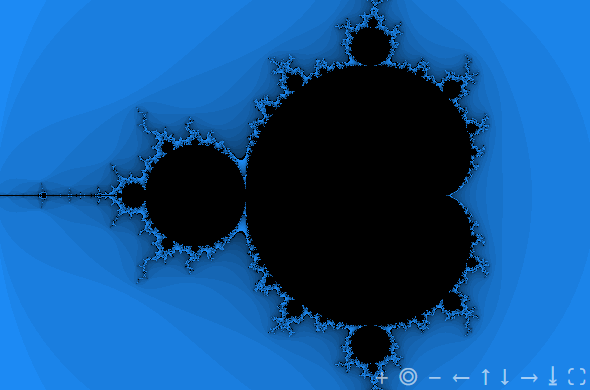

## Mandelbrot Webcomponent
This is a webcomponent that displays the mandelbrot set in an interactive widget. You can customize the widget using some attributes like `width` and `palette` (colors, possible values are `grayscale`, `blue` and `colorful`). By holding the Ctrl key and scrolling with the mouse wheel, one can zoom in on the mandelbrot set. You can also switch to the julia set by right clicking on any place inside the canvas.



### Webcomponent attributes
- `width`       The max width of the component
- `julia`       Flag for the additional display of the julia set when clicking on the canvas (defaults to `true`)
- `palette`     Color palette to display the set (options are `grayscale`, `blue` and `colorful`)
- `iterations`  Number of iterations that the plotting algorithm uses to determine if it converges or diverges (defaults to `100`)
- `random`      CControl the order of plotting (The set is plotted columnwise; if you provide `false` this will be sequentially from left to right, otherwise the columns will be drwan on the canvas in random order)

### Usage

```html
<script src="https://cdn.jsdelivr.net/gh/bernhard759/Webcomponent_mandelbrot-webcomponent/public/dist/mandelbrot-widget.min.js" defer></script>
...
<mandelbrot-widget width="800" julia="true" palette="colorful" iterations="100" random="true"></mandelbrot-widget>
```


### Example
An examplke can be found in the public folder deployed to github pages: https://bernhard759.github.io/Webcomponent_mandelbrot-webcomponent/example/
